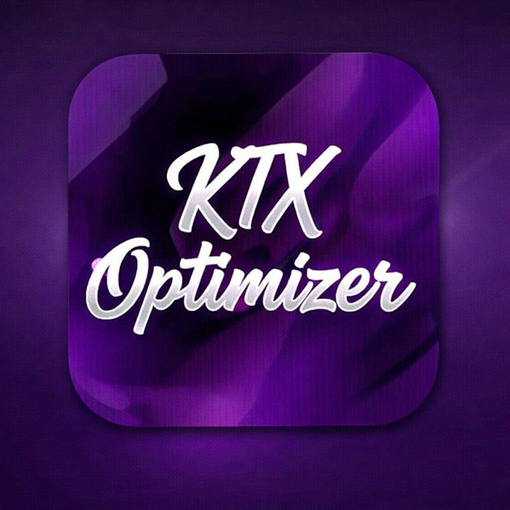

  

  # KT Optimizer - Site Oficial

  **Otimização extrema para Windows, feita por quem entende.**

  
  
  

 

## ⚡ Sobre o Projeto

Este repositório contém o código-fonte do site oficial do **KT Optimizer**, uma suíte de ferramentas projetada para extrair o máximo de performance do seu hardware, seja para jogos, produtividade ou uso geral. 

O site foi construído com foco em **alta performance e estética premium**, utilizando bibliotecas modernas como React, Vite e TailwindCSS, além de adotar os estilos visuais *Glassmorphism*, gradientes imersivos e animações avançadas.

## 🚀 O que o KT Optimizer faz?

- **Mais FPS:** Otimizações diretas no kernel e drivers.
- **Menos RAM:** Redução de processos e serviços não vitais do Windows.
- **Sem Telemetria:** Remoção do rastreamento agressivo da Microsoft.
- **Boot Rápido:** Desativação de pacotes na inicialização.
- **Rede Otimizada:** Tweaks de latência (TCP/IP) para menor ping.
- **Sem Bloatware:** Remoção de software e aplicativos lixo vindos de fábrica.

## 💻 Próximos Lançamentos (Roadmap)

- **KT Optimizer VIP:** A tão aguardada versão reescrita em **C#**, focada 100% em entregar mais estabilidade, bypass de segurança superior e personalizações inéditas.
- **AME Wizard Custom:** Uma playbook baseada no projeto AME Wizard para debloat completo e focado.
- **Discord Lite & Spotify Lite:** Versões remodeladas para usar o mínimo de memória e CPU enquanto você joga.

## 👥 A Equipe

*   🔥 **@kelvenapk** - Programador Principal
*   📣 **@thurdev155** - Divulgação e Marketing
*   🛡️ **@pegaso0x1337** - Engenheiro de Segurança

 

  Junte-se a nós no <strong><a href="https://discord.gg/ZmayZzzswC">Discord Oficial</a></strong>!  
  © 2026 KT Optimizer. Todos os direitos reservados.

